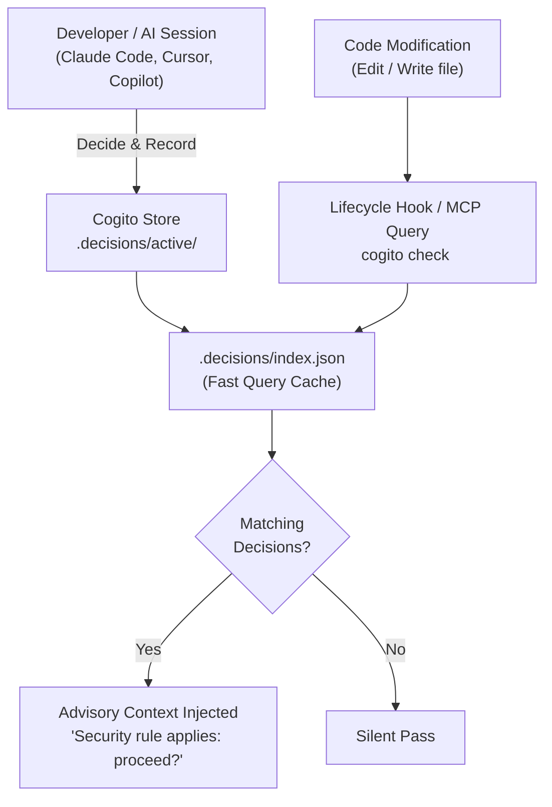
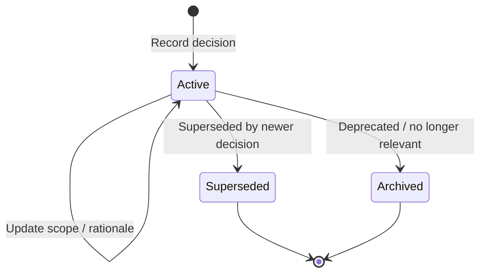

<div align="center">

# 🏛️ Cogito

**Institutional memory and architectural decision intelligence for your codebase.**  
*Captures the "why" behind technical choices and surfaces constraints automatically when affected files are edited.*

[](https://www.npmjs.com/package/cogito-cli)
[](https://www.npmjs.com/package/cogito-cli)
[](https://github.com/tarunagnihotri534/Cogito/actions)
[](https://opensource.org/licenses/MIT)
[](https://nodejs.org)

[Quick Start](#-quick-start) • [How It Works](#-how-it-works) • [Web Dashboard](#-web-dashboard) • [AI Integrations](#-ai-agent-integrations) • [CLI Reference](#-cli-reference) • [MCP Tools](#-mcp-tools-reference) • [TypeScript API](#-programmatic-api)

<br />

<p align="center">
  
</p>

</div>

---

## 💡 Why Cogito?

Every codebase accumulates critical architectural decisions that aren't obvious from reading source code alone:
- *Why is the authentication module synchronous?* (Preserves backward compatibility with SDK v1 consumers)
- *Why can't the browser extension call payment endpoints?* (PCI DSS compliance isolation scope)
- *Why was caching disabled on user profiles?* (Stale data caused billing support escalations)

These choices have vital rationale — regulatory constraints, performance trade-offs, and painful lessons learned. But this context usually lives in forgotten PR review threads, slack channels, or engineer memories.

When a new developer — or an AI coding agent (**Claude Code, Cursor, Copilot, Windsurf**) — touches that code later, they make the exact same mistakes because the **why** was never persisted alongside the codebase.

**Cogito** captures these decisions as scoped, structured Markdown files stored directly in your git repository. It surfaces them automatically at the exact moment they matter:

```text
⚠️  1 Architectural Decision matches 'src/extension/api/client.ts':
--------------------------------------------------
ID:        dec_20260728_x8k2p9
Summary:   Do not expose payment endpoints to browser extension API
Rationale: Browser extension context has weaker isolation; exposing payment APIs brings extension into PCI DSS scope
Scope:     src/api/payments/**/*.ts, src/extension/**/*.ts
Tags:      security, payments, extension
Author:    tarunagnihotri
--------------------------------------------------
```

> [!NOTE]
> **Advisory, Not Blocking:** Cogito never blocks builds or interrupts flow. It provides timely, contextual advisory nudges to human developers and AI assistants.

---

## 🚀 Quick Start

### 1. Installation

Install globally or use via `npx`:

```bash
# Global installation (recommended)
npm install -g cogito-cli

# Or run on-demand
npx cogito-cli --help
```

### 2. Initialize your repository

```bash
cd your-project
cogito init
```

This creates the `.decisions/` directory structure in your repository:
```text
.decisions/
├── active/          # Currently enforced architectural decisions
├── superseded/      # Historical decisions replaced by newer ones
├── archived/        # Retired decisions no longer applicable
└── index.json       # High-speed glob query index cache
```

### 3. Record an architectural decision

```bash
cogito record \
  --summary "Do not expose payment endpoints to extension API" \
  --rationale "PCI DSS compliance boundary — extensions have weaker security isolation" \
  --scope "src/api/payments/**/*.ts,src/extension/**/*.ts" \
  --tags "security,payments,extension" \
  --author "tarunagnihotri"
```

### 4. Check files against active decisions

```bash
# Check single file
cogito check src/extension/api/client.ts

# Machine-readable JSON output
cogito check src/extension/api/client.ts --json
```

---

## 🔄 How It Works



### The Decision Lifecycle



- **Active**: Stored in `.decisions/active/`. Actively matched during file modifications and PR reviews.
- **Superseded**: Stored in `.decisions/superseded/`. Linked to the new decision (`supersededBy`), preserving historical decision trails.
- **Archived**: Stored in `.decisions/archived/`. Preserved for auditability without triggering advisory warnings.

---

## 🖥️ Web Dashboard

Cogito includes a built-in, local web interface powered by React, Tailwind CSS, and Express:

```bash
cogito dashboard --port 3333
```

- 📋 **Decision Explorer**: Search, filter, and inspect active, superseded, and archived records.
- 🎯 **Interactive Scope Tester**: Enter any file path to test glob pattern matches in real time.
- 🩺 **Visual Doctor Diagnostics**: View code churn, dead globs, and health warnings visually.
- ✍️ **Browser Record Form**: Author and save new decisions directly from the UI.

---

## 🤖 AI Agent Integrations

Cogito is built from the ground up to empower AI coding agents.

### 1. Claude Code Integration

`cogito init` automatically configures Claude Code hooks in `.claude/settings.json`:

```json
{
  "mcpServers": {
    "cogito": {
      "command": "npx",
      "args": ["-y", "cogito-cli", "serve"]
    }
  },
  "hooks": {
    "PostToolUse": [
      {
        "matcher": "Write|Edit",
        "command": "cogito hook post-tool-use"
      }
    ],
    "SessionEnd": [
      {
        "command": "cogito hook session-end"
      }
    ]
  }
}
```

- **PostToolUse Hook**: Runs every time Claude modifies a file. If decisions govern that file, an advisory system message is injected into Claude's prompt.
- **SessionEnd Auto-Capture**: Silently parses the conversation transcript and extracts high-confidence candidates into `.decisions/.inbox/`.
- **/decide Slash Command**: Review the conversation and record architectural decisions on demand.

### 2. Multi-Agent Export (`cogito export`)

Export decisions directly into configuration files for all major AI coding tools:

```bash
# Export to all supported targets simultaneously
cogito export

# Target-specific exports
cogito export --target cursor     # Generates .cursor/rules/*.mdc
cogito export --target agents-md  # Generates managed section in AGENTS.md
cogito export --target copilot    # Generates .github/copilot-instructions.md
cogito export --target windsurf   # Generates .windsurfrules
```

#### Managed Section Markers
Files like `AGENTS.md` and `.github/copilot-instructions.md` use managed section markers so Cogito updates only its block without overwriting your custom instructions:

```markdown
# Repository Instructions

User instructions remain untouched here...

<!-- BEGIN:cogito -->
<!-- Generated by Cogito. Do not edit this block directly. -->

## Architectural Decisions
> Advisory architectural decisions tracked by Cogito. Consult before modifying matching files.

### [dec_20260728_x8k2p9] Do not expose payment endpoints to extension API
- **Scope**: `src/api/payments/**/*.ts`, `src/extension/**/*.ts`
- **Rationale**: Browser extension context has weaker isolation...
<!-- END:cogito -->
```

### 3. Pre-Commit Sync Verification

Ensure agent instruction files never go out of sync with decisions:

```bash
# Install non-destructive pre-commit hook (Husky or .git/hooks)
cogito export --install-pre-commit

# Verify in CI (exits with code 1 if files are out of sync)
cogito export --check
```

---

## 🛠️ CLI Reference

| Command | Description | Example |
|---------|-------------|---------|
| `cogito init` | Scaffolds `.decisions/`, installs Claude hooks & `/decide` command | `cogito init` |
| `cogito record` | Record a new architectural decision | `cogito record -s "Use Zod" -r "Validation" -c "src/**/*.ts"` |
| `cogito check <file>` | Match active decisions governing a file path | `cogito check src/api/auth.ts --json` |
| `cogito list` | List decisions with optional status & tag filters | `cogito list --status active --tags security` |
| `cogito get <id>` | Retrieve full Markdown decision content by ID | `cogito get dec_20260728_x8k2p9` |
| `cogito why <file>` | Human-readable explanation of why decisions apply to a file | `cogito why src/auth/session.ts` |
| `cogito log <id>` | Trace supersession lineage and evolution of a decision | `cogito log dec_20260728_x8k2p9` |
| `cogito search <q>` | Relevance-ranked full-text search across decisions | `cogito search "caching" --status active` |
| `cogito export` | Sync decisions to Cursor (`.mdc`), `AGENTS.md`, Copilot, Windsurf | `cogito export --target all` |
| `cogito import <dir>` | Bi-directional import from existing ADR directories (MADR/Nygard) | `cogito import docs/adr --from adr` |
| `cogito propose` | Extract candidate decisions from an agent JSONL transcript | `cogito propose --transcript session.jsonl` |
| `cogito review` | Interactive/automated review of proposed decisions in inbox | `cogito review --yes --min-score 0.8` |
| `cogito doctor` | Health check for dead globs, churned files, and expired reviews | `cogito doctor --strict` |
| `cogito lint` | Validate decision markdown files against schema | `cogito lint --json` |
| `cogito reindex` | Rebuild `.decisions/index.json` from disk markdown files | `cogito reindex` |
| `cogito serve` | Start Model Context Protocol (MCP) server over stdio | `cogito serve` |
| `cogito dashboard` | Launch the local web dashboard interface | `cogito dashboard --port 3333` |

---

## 🔌 MCP Tools Reference

When running as an MCP server (`cogito serve`), Cogito exposes 7 tools over standard stdio:

1. `query_decisions`: Find active decisions matching a target `file_path` or tag list.
2. `record_decision`: Create a new decision record with summary, rationale, glob scope, tags, and context.
3. `list_decisions`: Query decisions filtered by `status` (`active`, `superseded`, `archived`) or `tags`.
4. `get_decision`: Retrieve full decision metadata and Markdown body by ID.
5. `search_decisions`: Perform full-text search across all stored decisions.
6. `get_timeline`: Retrieve the supersession evolution chain for a decision.
7. `doctor`: Run health diagnostics to detect dead globs and staleness.

#### Connect with Claude Desktop / Cursor / Windsurf

Add to your MCP configuration file (`claude_desktop_config.json` or `.cursor/mcp.json`):

```json
{
  "mcpServers": {
    "cogito": {
      "command": "npx",
      "args": ["-y", "cogito-cli", "serve"]
    }
  }
}
```

---

## 📦 Monorepo Support

Cogito features zero-config monorepo detection:
- Automatically detects workspace layouts (`pnpm-workspace.yaml`, `package.json` workspaces, Lerna, Turborepo, Nx).
- **Package-Level Precedence**: If `packages/auth/.decisions/` exists, decisions within it take precedence when editing files under `packages/auth/`.
- **Root Context Inheritance**: Root-level repository standards (linting, infrastructure, compliance) apply complementarily across all packages.

---

## 💻 Programmatic API

Embed Cogito directly into build pipelines, GitHub bots, or custom CLI tools:

```typescript
import {
  check,
  record,
  list,
  get,
  doctor,
  lint,
  getTimeline,
  DecisionStore
} from 'cogito-cli';

// 1. Query decisions for a file
const decisions = check('.', 'src/api/auth.ts');
console.log(`Governed by ${decisions.length} decision(s).`);

// 2. Record a decision programmatically
const newDecision = record('.', {
  summary: 'Enforce HTTPS for all external API calls',
  rationale: 'Prevent MITM and satisfy SOC2 compliance requirements',
  scope: ['src/api/**/*.ts'],
  tags: ['security', 'network'],
  author: 'tarunagnihotri'
});

// 3. Run diagnostics programmatically
const report = doctor({ baseDir: '.' });
if (!report.healthy) {
  console.warn('Stale decisions detected:', report.issues);
}
```

---

## 🔒 Privacy & Local-First Philosophy

- **100% Offline & Local**: All decisions live in `.decisions/` as standard Markdown files inside your repository.
- **Zero Telemetry**: No external analytics, tracking, or network calls.
- **Version Controlled**: Decisions travel with your code, branch with your features, and review in standard Pull Requests.
- **Advisory by Design**: Guides engineers and AI models without blocking work.

---

## 👤 Author

**Tarun Agnihotri**
- GitHub: [@tarunagnihotri534](https://github.com/tarunagnihotri534)
- npm: [cogito-cli](https://www.npmjs.com/package/cogito-cli)
- Repository: [tarunagnihotri534/Cogito](https://github.com/tarunagnihotri534/Cogito)

---

## 📄 License

[MIT](LICENSE) © Tarun Agnihotri
