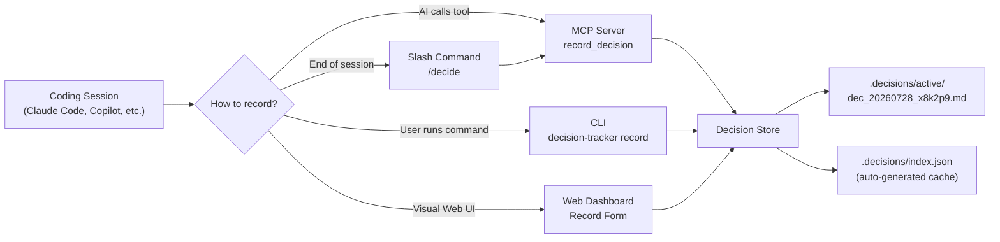
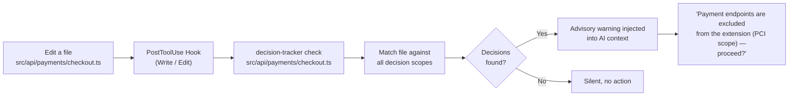
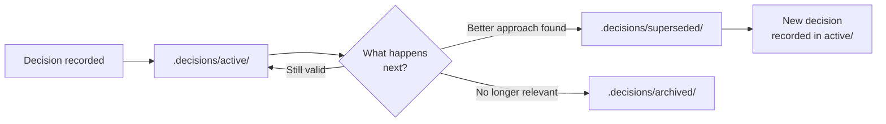
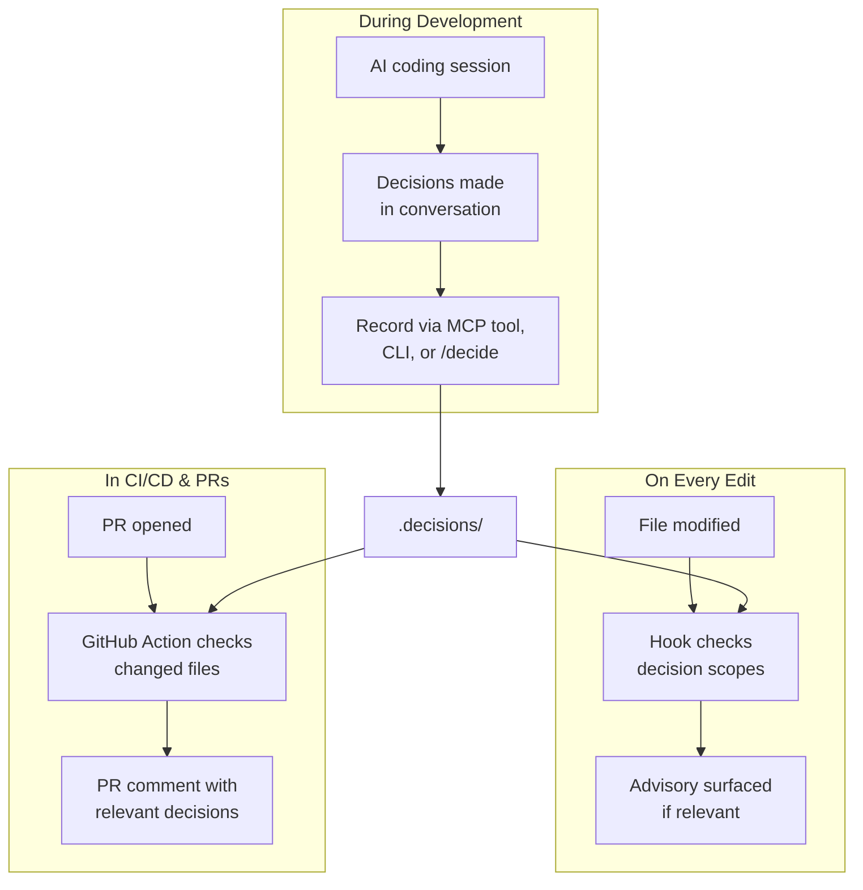

# decision-tracker

Institutional memory for your codebase. Captures the *why* behind architectural decisions and surfaces them automatically when matching files are edited.

Every codebase accumulates architectural choices that aren't obvious from reading the raw source code. Why the authentication module is synchronous. Why the browser extension cannot invoke the payments API directly. Why caching was intentionally disabled on the user profile endpoint. These choices have critical rationale — domain constraints, security boundaries, trade-offs, and lessons learned — but that context usually lives in forgotten chat logs, PR review threads, or developer memories.

When a new developer (or an AI assistant like Claude Code or Copilot) works in that area later, they lack this historical context. They re-introduce caching. They attempt to connect the extension directly to payments. They make the exact same mistakes because the *why* was never persisted alongside the codebase.

**decision-tracker** captures these decisions as structured, scoped Markdown files and surfaces them at the precise moment they matter — when you or your AI agent modify affected code:

- *"We chose not to expose payment endpoints to the browser extension because of PCI DSS compliance scope implications."*
- *"Kept the auth module synchronous to preserve backward compatibility with existing SDK v1 consumers."*
- *"Went with server-side rendering for the dashboard to avoid exposing sensitive analytics API credentials to the client."*
- *"Decided against caching user profiles because data updates frequently and stale data triggered support escalations."*

It's advisory, not blocking. A helpful nudge that says: *"Hey, this area of the codebase has established architectural context you should know before making changes."* You can always supersede or update a decision when requirements evolve.

---

## How it works

### Recording a decision

When an architectural choice is made during a coding session, it gets captured and stored as a scoped, queryable markdown file.



### Surfacing at the right moment

When code is edited — by a human developer or an AI assistant — relevant decisions are automatically surfaced as advisory context.



### Lifecycle of a decision

Decisions aren't permanent — they evolve as project requirements change.



### Where it fits in your workflow



---

## Quick start

### Install

```bash
npm install -g decision-tracker
```

Or use directly without global installation:

```bash
npx decision-tracker init
```

### Initialize in your project

```bash
cd your-project
decision-tracker init
```

This creates:
```
.decisions/
├── active/          # Currently active decisions
├── superseded/      # Replaced by newer decisions
├── archived/        # No longer relevant
└── index.json       # Auto-generated index cache for fast glob queries
```

### Record your first decision

```bash
decision-tracker record \
  --summary "Use Zod for all runtime validation" \
  --rationale "Type-safe, composable, works seamlessly with TS type inference" \
  --scope "src/**/*.ts,api/**/*.ts" \
  --tags "validation,schema" \
  --author "tarunagnihotri"
```

### Check decisions for a file

```bash
decision-tracker check src/api/users.ts
```

Output:
```text
⚠️  1 Architectural Decision(s) match 'src/api/users.ts':

--------------------------------------------------
ID:        dec_20260728_x8k2p9
Summary:   Use Zod for all runtime validation
Rationale: Type-safe, composable, works seamlessly with TS type inference
Scope:     src/**/*.ts, api/**/*.ts
Tags:      validation, schema
Author:    tarunagnihotri
--------------------------------------------------
```

---

## Web dashboard

`decision-tracker` includes a local React + Tailwind CSS dashboard for inspecting, searching, and managing decisions visually alongside the CLI and MCP server workflows.

```bash
decision-tracker dashboard --port 3333
```

- **Interactive Table & Grid**: Filter decisions by status (`active`, `superseded`, `archived`) and tag sets.
- **Scope Tester Tool**: Enter any file path to test glob matchers interactively.
- **Visual Record Form**: Submit new decisions directly from the browser UI.

---

## Integration with Claude Code

`decision-tracker` integrates natively with Claude Code as an **MCP server** (so Claude can record and query decisions) and as a **PostToolUse hook** (so Claude is automatically warned about relevant decisions when editing files).

### 1. MCP Server setup

Add `decision-tracker` to your Claude Code MCP configuration (`.claude/settings.json`):

```json
{
  "mcpServers": {
    "decision-tracker": {
      "command": "npx",
      "args": ["-y", "decision-tracker", "serve"]
    }
  }
}
```

This exposes 4 tools to Claude Code:

| Tool | Description |
|------|-------------|
| `query_decisions` | Find active decisions relevant to a file path or tag list |
| `record_decision` | Record a new architectural decision |
| `list_decisions` | List all decisions, filterable by status or tags |
| `get_decision` | Fetch full details of a specific decision by ID |

Claude automatically invokes `query_decisions` when analyzing architecture, and `record_decision` when technical choices are made.

### 2. PostToolUse hook setup

`decision-tracker init` automatically creates `.claude/hooks/check-decisions.sh` and configures `.claude/settings.json`:

```json
{
  "hooks": {
    "PostToolUse": [
      {
        "matcher": "Write|Edit",
        "command": ".claude/hooks/check-decisions.sh"
      }
    ]
  }
}
```

The hook runs after every `Write` or `Edit` tool call. If the file being edited matches active decision glob scopes, Claude receives an advisory system message:

> **Advisory:** 1 existing architectural decision(s) apply to this file:
> - Use Zod for all runtime validation (scope: `src/**/*.ts`) [ID: `dec_20260728_x8k2p9`]
>
> These are advisory — you may proceed, but consider whether your changes align with these decisions.

### 3. `/decide` slash command

`decision-tracker init` copies a custom slash command to `.claude/commands/decide.md`. Run it during a conversation:

```text
/decide
```

Claude will review the conversation, extract any architectural decisions that were made, and execute `record_decision` for each one.

---

## Integration with GitHub Copilot CLI & Git

GitHub Copilot CLI (`gh copilot`) and Git workflows can incorporate `decision-tracker` via shell scripts and Git hooks.

### 1. Pre-check before asking Copilot

Check governing decisions before requesting edits from Copilot:

```bash
decision-tracker check src/api/auth.ts
gh copilot suggest "add OAuth support to src/api/auth.ts"
```

### 2. Shell alias for Copilot-aware editing

Add to your `.bashrc` or `.zshrc`:

```bash
copilot-edit() {
  local file="$1"
  shift

  local decisions
  decisions=$(decision-tracker check "$file" 2>/dev/null)
  if [ -n "$decisions" ] && ! echo "$decisions" | grep -q "No decisions"; then
    echo "--- Relevant Decisions ---"
    echo "$decisions"
    echo "---"
  fi

  gh copilot suggest "$@"
}
```

### 3. Git pre-commit hook

Add decision awareness to your git workflow by creating `.git/hooks/pre-commit`:

```bash
#!/usr/bin/env bash
CHANGED_FILES=$(git diff --cached --name-only)
WARNINGS=""

for file in $CHANGED_FILES; do
  result=$(decision-tracker check "$file" --json 2>/dev/null || echo "[]")
  count=$(echo "$result" | node -e 'console.log(JSON.parse(fs.readFileSync(0)).length)' 2>/dev/null || echo "0")
  if [ "$count" -gt 0 ]; then
    WARNINGS="${WARNINGS}\n  - ${file}"
  fi
done

if [ -n "$WARNINGS" ]; then
  echo "🧠 Decision Tracker: The following staged files match active architectural decisions:"
  echo -e "$WARNINGS"
  echo "Review with: decision-tracker check <file>"
fi
```

### 4. GitHub Actions for PR review

Add `.github/workflows/decision-check.yml` to automatically comment on pull requests when changed files match decision scopes:

```yaml
name: Decision Check
on: [pull_request]

jobs:
  check-decisions:
    runs-on: ubuntu-latest
    steps:
      - uses: actions/checkout@v4
      - uses: actions/setup-node@v4
        with:
          node-version: "20"
      - run: npm install -g decision-tracker

      - name: Check changed files against decisions
        run: |
          node -e '
            const execSync = require("child_process").execSync;
            const files = execSync("git diff --name-only origin/${{ github.base_ref }}...HEAD", { encoding: "utf-8" }).split("\n").filter(Boolean);
            for (const file of files) {
              const res = execSync(`decision-tracker check "${file}" --json`, { encoding: "utf-8" });
              console.log(file, res);
            }
          '
```

---

## Integration with any AI agent

`decision-tracker` is designed to work with any AI coding agent. The general pattern:

1. **Before Editing**: Call `decision-tracker check <file> --json` to retrieve matching decision records.
2. **Prompt Injection**: Include the retrieved rationale and constraints in your agent's system prompt or context window.
3. **After Decisions Are Made**: Call `decision-tracker record` (or invoke the MCP server tool) to log new decisions.

---

## Decision file format

Each decision is stored as a standard Markdown file with YAML frontmatter:

```markdown
---
id: dec_20260728_x8k2p9
summary: Do not expose payment endpoints to browser extension API
rationale: Browser extension context has weaker isolation; exposing payment APIs would bring the extension into PCI DSS scope
scope:
  - "src/api/payments/**/*.ts"
  - "src/extension/**/*.ts"
tags:
  - security
  - payments
  - extension
author: tarunagnihotri
confidence: explicit
status: active
created: 2026-07-28T15:00:00Z
---

# Do not expose payment endpoints to browser extension API

## Rationale
Browser extension context has weaker isolation; exposing payment APIs would bring the extension into PCI DSS scope.

## Context
During the browser extension build-out, we considered letting the extension call the payments API directly. After reviewing PCI DSS requirements, we determined that exposing payment endpoints to the extension would require the extension to be in scope for PCI compliance.

## Consequences
The extension must go through the main web app for any payment-related actions. No payment types, schemas, or API clients should be imported in the extension codebase.
```

### Frontmatter fields

| Field | Type | Description |
|-------|------|-------------|
| `id` | string | Unique ID (`dec_YYYYMMDD_<nanoid>`) |
| `summary` | string | One-line summary of the decision |
| `rationale` | string | Rationale explaining why this choice was made |
| `scope` | string[] | Array of glob patterns for governed files |
| `tags` | string[] | Array of categorization tags |
| `author` | string | Author or recorder of the decision |
| `confidence` | enum | `explicit` (stated), `inferred` (detected), or `suggested` |
| `status` | enum | `active`, `superseded`, or `archived` |
| `created` | ISO 8601 | ISO timestamp when recorded |
| `context` | string | Optional background context |
| `consequences` | string | Optional consequences & trade-offs |
| `supersededBy` | string | ID of replacing decision (optional) |

### Body sections

- **Rationale**: Core technical explanation for the decision.
- **Context**: Historical background and conditions under which the decision was made.
- **Consequences**: Downstream impacts, constraints, and prohibited patterns.

### Index file

`.decisions/index.json` is auto-generated for fast file-to-decision lookups:

```json
[
  {
    "id": "dec_20260728_x8k2p9",
    "summary": "Do not expose payment endpoints to browser extension API",
    "rationale": "Browser extension context has weaker isolation...",
    "scope": ["src/api/payments/**/*.ts", "src/extension/**/*.ts"],
    "tags": ["security", "payments", "extension"],
    "author": "tarunagnihotri",
    "status": "active",
    "confidence": "explicit",
    "created": "2026-07-28T15:00:00Z",
    "filePath": ".decisions/active/dec_20260728_x8k2p9.md"
  }
]
```

---

## CLI reference

### `decision-tracker init`

Initialize decision tracking in the current repository. Creates the `.decisions/` directory structure, copies the hook script to `.claude/hooks/`, and installs the `/decide` slash command to `.claude/commands/`.

### `decision-tracker record`

Record a new decision from the command line interface.

```bash
decision-tracker record \
  --summary "Use PostgreSQL for persistence" \
  --rationale "ACID compliance, JSON support, mature ecosystem" \
  --scope "src/db/**/*.ts,src/models/**/*.ts" \
  --tags "database,persistence" \
  --author "tarunagnihotri" \
  --confidence explicit \
  --context "Evaluated SQLite, MySQL, and PostgreSQL" \
  --consequences "All persistence operations must go through pg driver"
```

**Options:**

| Flag | Required | Default | Description |
|------|----------|---------|-------------|
| `-s, --summary` | Yes | — | One-line decision summary |
| `-r, --rationale` | Yes | — | Rationale behind the decision |
| `-c, --scope` | Yes | — | Comma-separated or space-separated glob patterns |
| `-t, --tags` | No | `[]` | Categorization tags |
| `-a, --author` | No | `anonymous` | Author name or handle |
| `--confidence` | No | `explicit` | `explicit`, `inferred`, or `suggested` |
| `--context` | No | — | Additional background context |
| `--consequences` | No | — | Expected consequences or trade-offs |
| `--supersedes` | No | — | ID of an old decision superseded by this one |

### `decision-tracker check <file>`

Query active decisions governing a specific file path.

```bash
decision-tracker check src/api/users.ts
decision-tracker check src/api/users.ts --json   # JSON output format
```

### `decision-tracker list`

List recorded decisions with optional status and tag filters.

```bash
decision-tracker list
decision-tracker list --status active
decision-tracker list --tags validation,schema
decision-tracker list --json
```

### `decision-tracker get <id>`

Retrieve full decision details and Markdown document by ID.

```bash
decision-tracker get dec_20260728_x8k2p9
decision-tracker get dec_20260728_x8k2p9 --json
```

### `decision-tracker serve`

Start the Model Context Protocol (MCP) server over stdio for use with Claude Code or other MCP-compatible clients.

```bash
decision-tracker serve
```

### `decision-tracker dashboard`

Start the local React web dashboard server.

```bash
decision-tracker dashboard [--port 3333] [--no-open]
```

---

## MCP tools reference

When running as an MCP server (`decision-tracker serve`), `decision-tracker` exposes four tools:

### `query_decisions`

Find decisions relevant to a file path or tag list.

**Parameters:**
- `file_path` (string, optional): File path to match against decision glob scopes.
- `tags` (string[], optional): Array of tags to filter by.

### `record_decision`

Record a new architectural decision.

**Parameters:**
- `summary` (string, required): One-line summary.
- `rationale` (string, required): Why this decision was made.
- `scope` (string[], required): Glob patterns for affected files.
- `tags` (string[], optional): Categorization tags.
- `author` (string, default: `"anonymous"`): Author name.
- `context` (string, optional): Additional background context.
- `consequences` (string, optional): Expected consequences.
- `confidence` (enum, default: `"explicit"`): `explicit`, `inferred`, or `suggested`.
- `supersedes` (string, optional): ID of superseded decision.

### `list_decisions`

List all decisions with optional status and tag filtering.

**Parameters:**
- `status` (enum, optional): `active`, `superseded`, or `archived`.
- `tags` (string[], optional): Filter by tags.

### `get_decision`

Fetch complete details of a decision by ID.

**Parameters:**
- `id` (string, required): Decision ID (e.g. `dec_20260728_x8k2p9`).

---

## Philosophy

### Advisory, not blocking

`decision-tracker` never blocks developers or prevents commits. It surfaces information — *"Here is what was decided before, and why"* — allowing humans and AI agents to make informed choices. If circumstances change, supersede or archive the decision.

### Decisions are living documents

Decisions evolve with your project over time:
- **Superseded**: A new decision replaces an outdated one (old decision moves to `.decisions/superseded/`).
- **Archived**: A decision stops being relevant (moved to `.decisions/archived/`).
- **Updated**: Rationale or scopes are refined as system understanding deepens.

### Human-readable first

Decisions are standard Markdown files stored directly in your repository. They can be read with `cat` or `vim`, reviewed in PRs, and diffed with Git. `index.json` is a derived cache — the Markdown files are always the source of truth.

### Works with your version control

Because `.decisions/` lives inside your repository, architectural context travels with your code, stays in sync across branches, and persists across forks.

---

## Examples

### The kind of decisions this is for

| Decision | Why it matters |
|----------|---------------|
| *"Don't add caching to the user profile endpoint"* | Previous team tried it, stale data caused support escalations. Without this record, future engineers will attempt caching again. |
| *"Keep notification service as a separate process"* | Embedding it caused memory exhaustion under burst traffic. Appears like unnecessary complexity without historical context. |
| *"Browser extension must not import from `src/api/payments/`"* | PCI DSS compliance boundary. An AI agent cannot infer regulatory constraints without explicit advisory context. |
| *"The `/admin` endpoints intentionally skip rate limiting"* | Internal batch operations broke under rate limits. Appears like a security flaw without recorded rationale. |
| *"Chose Postgres over DynamoDB for audit logging"* | Compliance reporting required complex relational queries. Appears like append-only key-value data at first glance. |

### Capture decisions from a coding session

During a conversation with Claude Code:

```text
You: Can we add the payment flow to the browser extension?
Claude: Exposing payment endpoints to the browser extension would bring the extension into PCI DSS compliance scope. I recommend keeping payment logic in the web application and redirecting from the extension.
You: Good call, let's do that.
Claude: [Records decision via record_decision tool or by running /decide]
```

Later, when modifying extension code:

```text
Claude: Advisory: 1 existing architectural decision applies to this file:
  - Do not expose payment endpoints to browser extension API (PCI DSS scope implications)
  This file is in the extension codebase — payment imports are intentionally excluded here.
  Would you like to proceed?
```

### Review decisions before starting work

```bash
$ decision-tracker list --status active

📋 Found 3 Decision(s):

• [dec_20260728_x8k2p9] 🟢 active
  Summary:   Do not expose payment endpoints to browser extension API
  Scope:     src/api/payments/**/*.ts, src/extension/**/*.ts
  Tags:      security, payments, extension
  Created:   2026-07-28T15:00:00Z
```

### Check a file before modifying it

```bash
$ decision-tracker check src/extension/api/client.ts

⚠️  1 Architectural Decision(s) match 'src/extension/api/client.ts':

--------------------------------------------------
ID:        dec_20260728_x8k2p9
Summary:   Do not expose payment endpoints to browser extension API
Rationale: Browser extension context has weaker isolation; exposing payment APIs brings extension into PCI DSS scope
Scope:     src/api/payments/**/*.ts, src/extension/**/*.ts
Tags:      security, payments, extension
Author:    tarunagnihotri
--------------------------------------------------
```

---

## Tech stack

- **[TypeScript](https://www.typescriptlang.org/)** — Node.js 20+, ES2022 modules
- **[@modelcontextprotocol/sdk](https://www.npmjs.com/package/@modelcontextprotocol/sdk)** — MCP server implementation
- **[commander](https://www.npmjs.com/package/commander)** — CLI framework
- **[gray-matter](https://www.npmjs.com/package/gray-matter)** — YAML frontmatter parser
- **[minimatch](https://www.npmjs.com/package/minimatch)** — Glob pattern matching engine
- **[zod](https://www.npmjs.com/package/zod)** — Input schema validation
- **[nanoid](https://www.npmjs.com/package/nanoid)** — Collision-resistant ID generation
- **[React](https://react.dev/) + [Tailwind CSS](https://tailwindcss.com/) + [Vite](https://vitejs.dev/)** — Web dashboard UI
- **[Express](https://expressjs.com/)** — Local dashboard server
- **[vitest](https://vitest.dev/)** — Test runner

---

## License

MIT
